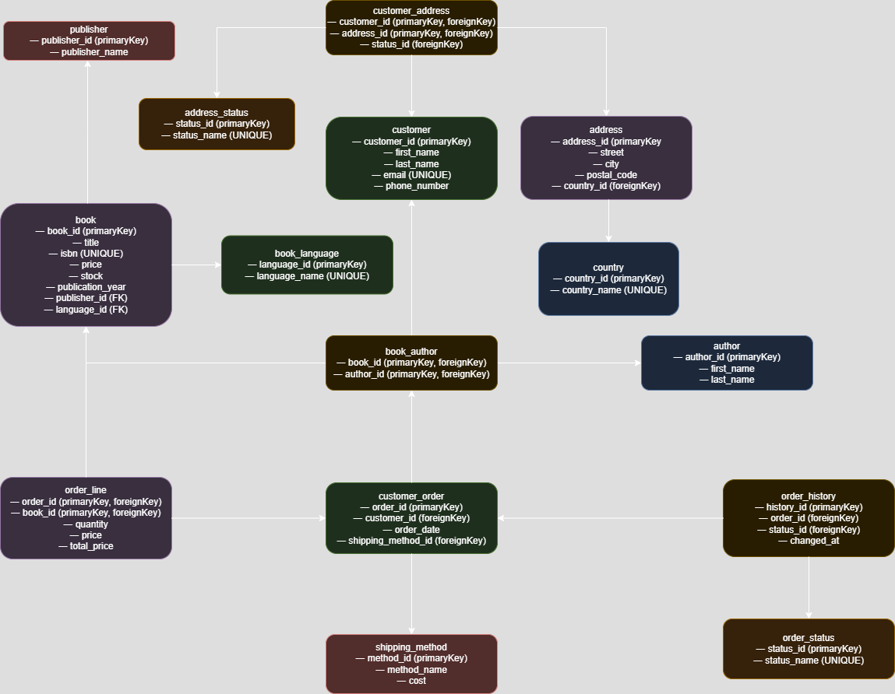

# 📚 Bookstore Database

This project defines a relational database schema for a bookstore system. It includes tables for managing customers, books, authors, orders, addresses, and access control through user roles. The structure is normalized and supports real-world operations such as multi-author books, multiple addresses per customer, and order tracking.

## 📦 Features

- Customers and their contact info
- Support for multiple addresses per customer with status
- Books with authors, publishers, and languages
- Order system with order lines, status history, and shipping methods
- Role-based user access (Admin, Developer, Employee)

## 🗂️ Database: `bookstore_db`

### 1. `country`
Stores country names used for addresses.
- `country_id` (PK)
- `country_name` (unique)

### 2. `address`
Stores street, city, postal code, and country info.
- Linked to `country`

### 3. `address_status`
Defines status of an address (`current`, `old`)

### 4. `customer`
Stores customer name, email, and phone number.

### 5. `customer_address`
Many-to-many relationship between customers and addresses, with a status.

### 6. `publisher`
Stores names of book publishers.

### 7. `book_language`
Lists available languages for books.

### 8. `book`
Stores book data: title, ISBN, price, stock, year, publisher, language.

### 9. `author`
Stores author names.

### 10. `book_author`
Many-to-many relationship between books and authors.

### 11. `shipping_method`
Shipping types like Standard or Express, with cost.

### 12. `order_status`
Tracks order statuses: pending, shipped, delivered.

### 13. `customer_order`
Each order belongs to a customer and has a shipping method.

### 14. `order_line`
Each order can have multiple books, each with price and quantity.

### 15. `order_history`
Tracks changes in order status over time.

## 👤 Users & Permissions

- **Admin (Monica)**: Full privileges on all tables
- **Developer (Nzyoka)**: SELECT, INSERT, UPDATE, DELETE
- **Employee (Wiltord)**: SELECT only

## 🧪 Sample Users

```sql
-- Admin
CREATE USER 'Monica'@'%' IDENTIFIED BY 'admin@123';
GRANT ALL PRIVILEGES ON bookstore_db.* TO 'Monica'@'%';

-- Developer
CREATE USER 'Nzyoka'@'%' IDENTIFIED BY 'dev@123';
GRANT SELECT, INSERT, UPDATE, DELETE ON bookstore_db.* TO 'Nzyoka'@'%';

-- Employee
CREATE USER 'Wiltord'@'%' IDENTIFIED BY 'employee@123';
GRANT SELECT ON bookstore_db.* TO 'Wiltord'@'%';

FLUSH PRIVILEGES;
```
## Bookstore Er diagram



## ✅ Notes

- All foreign keys enforce relational integrity.
- The schema supports expansion (e.g. book reviews, categories, payments).
- Sample data included for testing queries and joins.

---
Built for SQL-based bookstore applications and training purposes.
